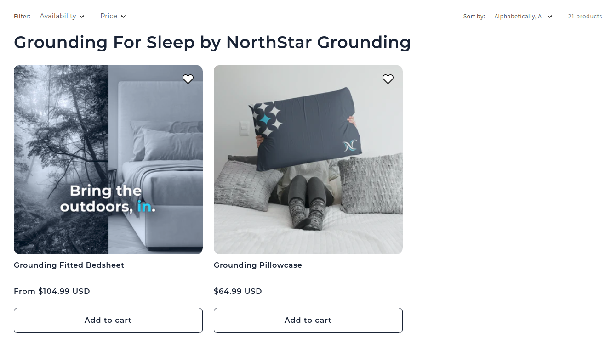

# NorthStar Grounding Shopify Website

## Url
https://northstargrounding.com

## Product Listing With Filters

## Product Details including Gallery & Variations

## Project Overview

NorthStar Grounding is a Shopify-based eCommerce website developed using the Dawn theme with Schema Version 12.0.0. The main goal of the project was to create a clean, fast, and user-friendly shopping experience while keeping the website easy to manage from the Shopify admin panel.

The website was developed with a strong focus on product presentation, smooth customer experience, mobile responsiveness, and flexible content management. Along with the frontend design and theme customization, several Shopify features and custom solutions were implemented to improve both usability and performance.

## Product Detail Page Development

A major part of the development work was focused on the product detail pages. The website uses Shopify product variants to manage different product options properly. The variant selection was connected carefully with pricing, images, and product availability so customers could instantly see updated information after selecting any option.

The product image gallery was also customized to improve the overall browsing experience. The default Dawn theme gallery behavior was adjusted to make product images more organized and smoother to navigate. Variant-specific images were connected properly so customers could instantly view the correct product image after changing product options.

Related products were added inside the product pages to help customers discover similar products easily. The section was integrated in a way that matches the website design and keeps the shopping flow natural without making the page feel overloaded.

Shop Pay integration was also used on the website to provide a faster checkout experience. This helped reduce extra checkout steps and made the purchasing process easier, especially for mobile users.

## Use of Shopify Metafields

Shopify custom metafields were used in several sections of the website including the homepage, product pages, and other inner pages. This allowed dynamic content management directly from the Shopify backend without hardcoding everything inside the theme files.

Using metafields helped make the website more flexible for future updates. Content sections could be updated easily from the admin panel without requiring development changes every time. This approach also helped keep the content structure cleaner and more manageable for the client.

## Currency Switcher Integration

A currency changer dropdown was added in the footer section of the website. Since the store can receive visitors from different countries, the currency switcher helps users view product prices more comfortably in their local currency.

The integration was adjusted carefully so it works smoothly with the overall website layout without affecting the user experience.

## Responsive Design and User Experience

Mobile responsiveness was an important part of the development process because Shopify stores usually receive a large amount of mobile traffic. Every major section including banners, product galleries, sliders, and checkout-related elements was tested carefully across desktop, tablet, and mobile devices.

The focus was to keep the browsing and shopping experience smooth on all screen sizes while maintaining fast loading speed and clean layouts.

## Challenges During Development

One common challenge during Shopify theme development was handling variant-based image updates properly inside the Dawn theme. In many cases, the default theme behavior does not fully support advanced image switching requirements, especially when multiple variants use similar media files.

This issue was solved by customizing the JavaScript logic and improving the variant change handling process. The final setup allowed images to update more reliably and smoothly during variant selection.

Another challenge was maintaining website performance while adding multiple custom sections and dynamic content. Shopify themes can become slower if too many heavy customizations or unnecessary scripts are added.

To avoid this problem, the development focused on lightweight customization methods and cleaner code structure. This helped maintain fast page loading speed and overall responsiveness.

Managing metafield-based content was another area that required careful planning. Without a proper structure, dynamic content setups can become difficult to manage later from the backend. A cleaner metafield structure was created so the client can update and manage content easily even after project completion.

## Final Outcome

The final website was developed with a balance of design, performance, flexibility, and ease of management. The project was not only focused on building a visually clean Shopify store but also on creating a smooth shopping experience for customers and a simple content management process for the store owner.

The combination of Shopify variants, customized product galleries, related products, Shop Pay integration, metafields, currency switching, and responsive design helped create a modern and scalable eCommerce website that is easy to use and maintain.
